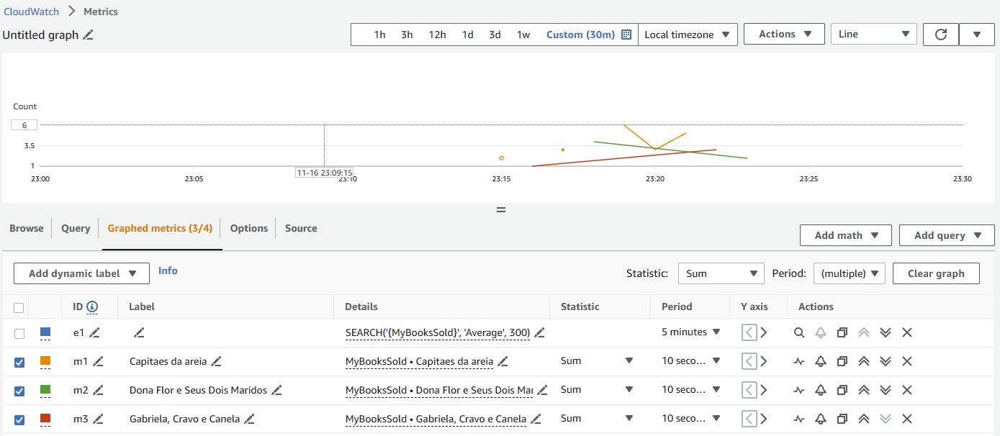

# 1. What is this project

This is a small / simple example that shows how using AWS SDK to create Custom Metrics.

| DateHour            | Book                          | Qty |
| ------------------- | ----------------------------- | --- |
| 16/11/2023 10:00:10 | Capitaes da areia             | 2   |
| 16/11/2023 10:00:20 | Gabriela, Cravo e Canela      | 1   |
| 16/11/2023 10:00:30 | Capitaes da areia             | 3   |
| 16/11/2023 10:00:40 | Dona Flor e Seus Dois Maridos | 4   |
| 16/11/2023 10:00:50 | Capitaes da areia             | 6   |
| 16/11/2023 10:01:00 | Capitaes da areia             | 3   |
| 16/11/2023 10:01:10 | Capitaes da areia             | 5   |
| 16/11/2023 10:01:20 | Gabriela, Cravo e Canela      | 3   |
| 16/11/2023 10:01:30 | Dona Flor e Seus Dois Maridos | 2   |

# 2. Project Type Console

.NET 8.0

## 2.1. Result of this project

