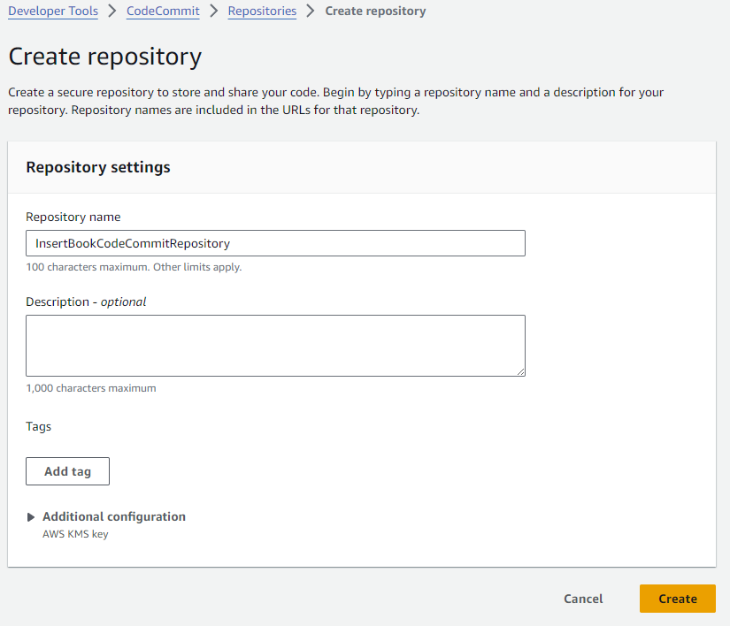
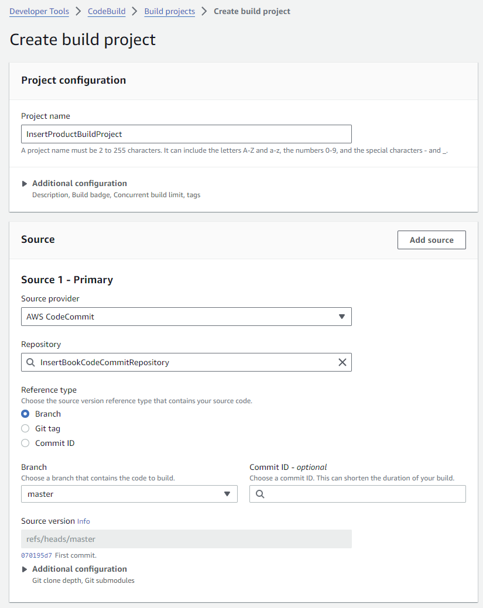
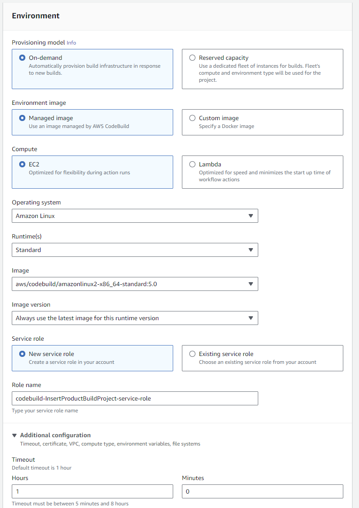
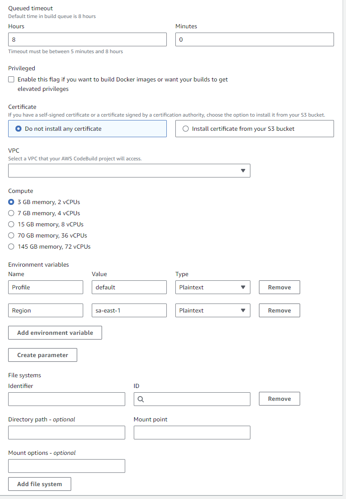
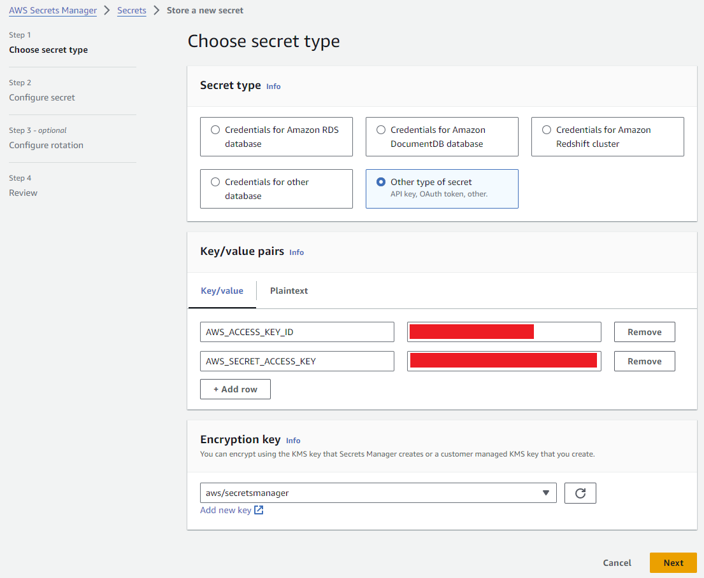
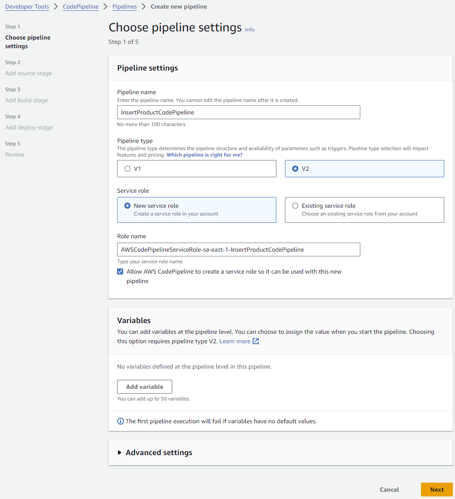
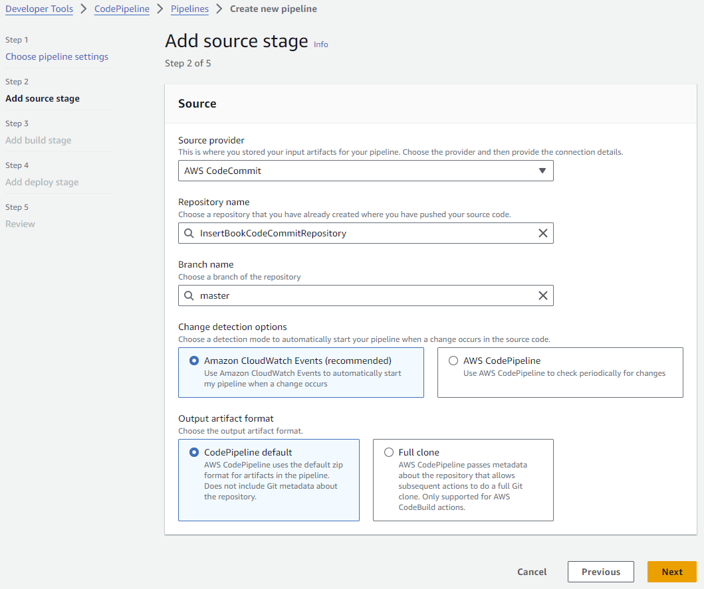
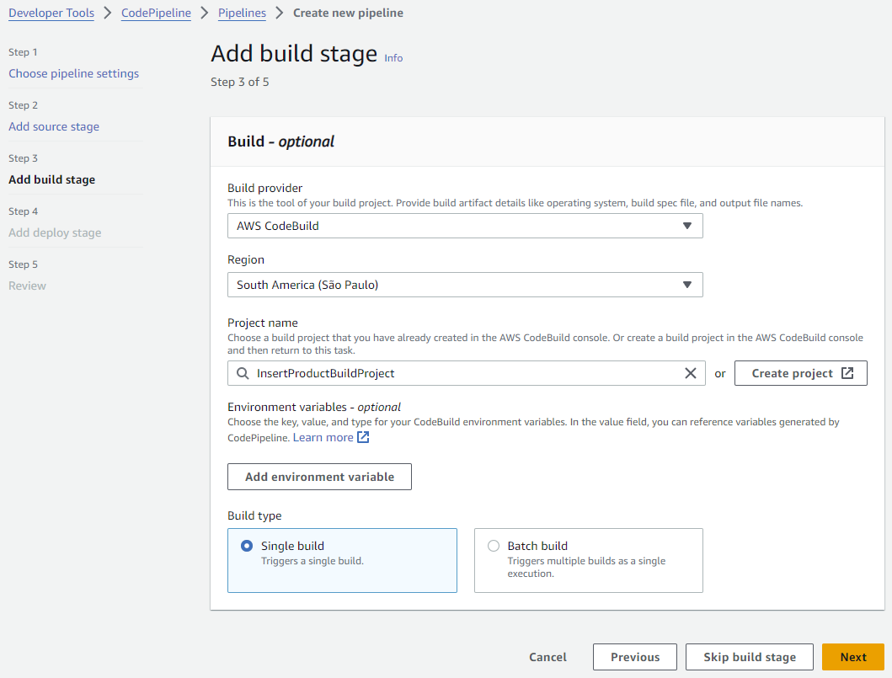

# 1. Details

- No lambda version control.
- No rollback.

# 2. Steps

1. Create AWS CodeCommit.
   
2. Create AWS IAM Role.
   ```
       {
           "Version": "2012-10-17",
           "Statement": [
               {
                   "Effect": "Allow",
                   "Resource": [
                       "arn:aws:logs:sa-east-1:939645320583:log-group:/aws/codebuild/InsertProductBuildProject",
                       "arn:aws:logs:sa-east-1:939645320583:log-group:/aws/codebuild/InsertProductBuildProject:*"
                   ],
                   "Action": [
                       "logs:CreateLogGroup",
                       "logs:CreateLogStream",
                       "logs:PutLogEvents"
                   ]
               },
               {
                   "Effect": "Allow",
                   "Resource": [
                       "arn:aws:s3:::codepipeline-sa-east-1-*"
                   ],
                   "Action": [
                       "s3:PutObject",
                       "s3:GetObject",
                       "s3:GetObjectVersion",
                       "s3:GetBucketAcl",
                       "s3:GetBucketLocation"
                   ]
               },
               {
                   "Effect": "Allow",
                   "Resource": [
                       "arn:aws:codecommit:sa-east-1:939645320583:InsertBookCodeCommitRepository"
                   ],
                   "Action": [
                       "codecommit:GitPull"
                   ]
               },
               {
                   "Effect": "Allow",
                   "Action": [
                       "codebuild:CreateReportGroup",
                       "codebuild:CreateReport",
                       "codebuild:UpdateReport",
                       "codebuild:BatchPutTestCases",
                       "codebuild:BatchPutCodeCoverages"
                   ],
                   "Resource": [
                       "arn:aws:codebuild:sa-east-1:939645320583:report-group/InsertProductBuildProject-*"
                   ]
               },
               {
                   "Effect": "Allow",
                   "Action": [
                       "secretsmanager:GetSecretValue"
                   ],
                   "Resource": [
                       "*"
                   ]
               }
           ]
       }
   ```
3. Create AWS CodeBuild project.
   
   
   
4. Create AWSSecrets Manager.
   
5. Create AWS CodePipeline.
   
   
   
