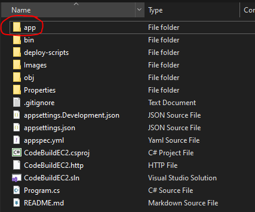
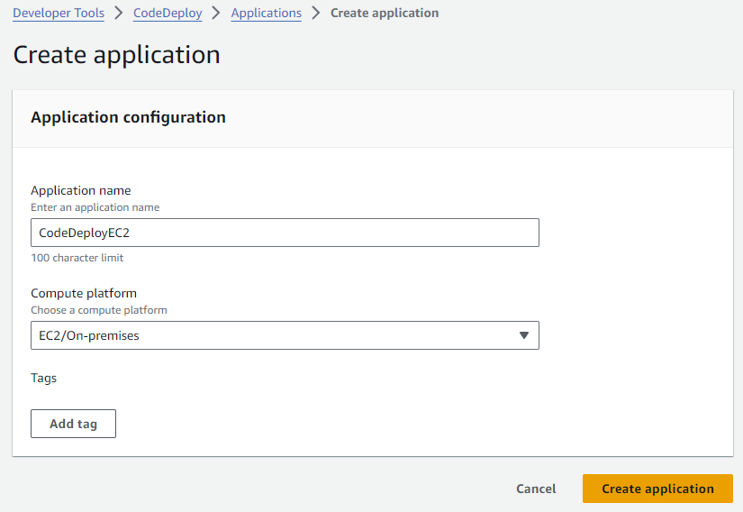
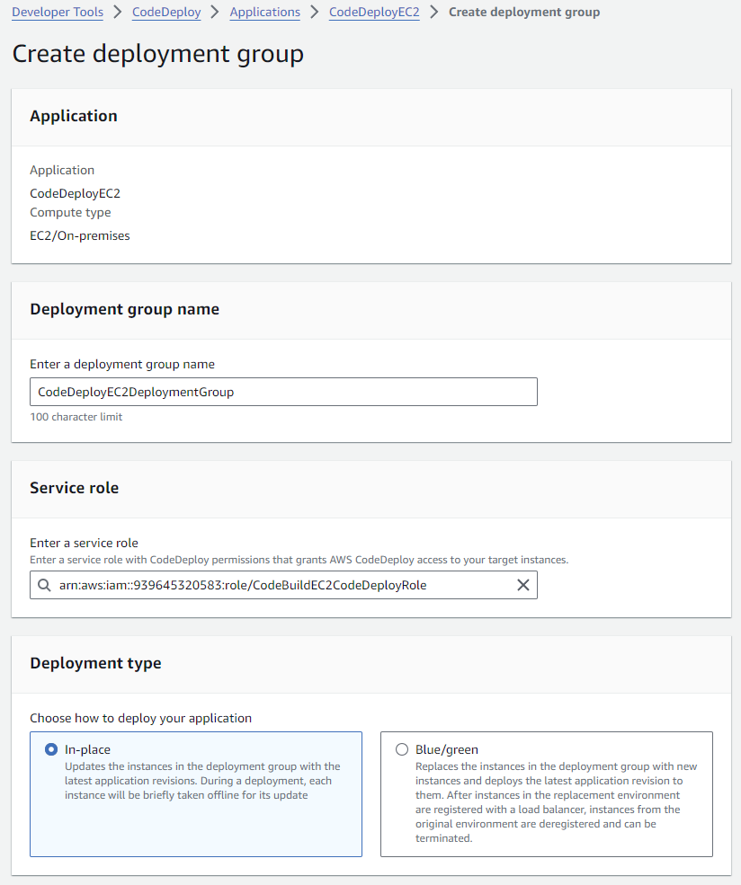
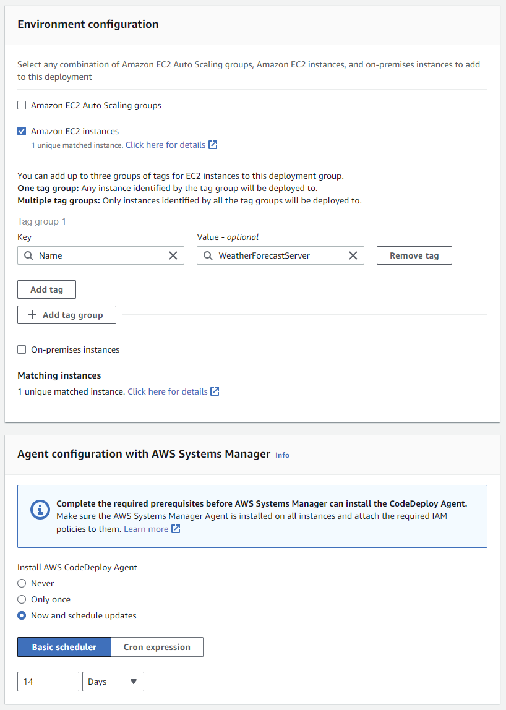
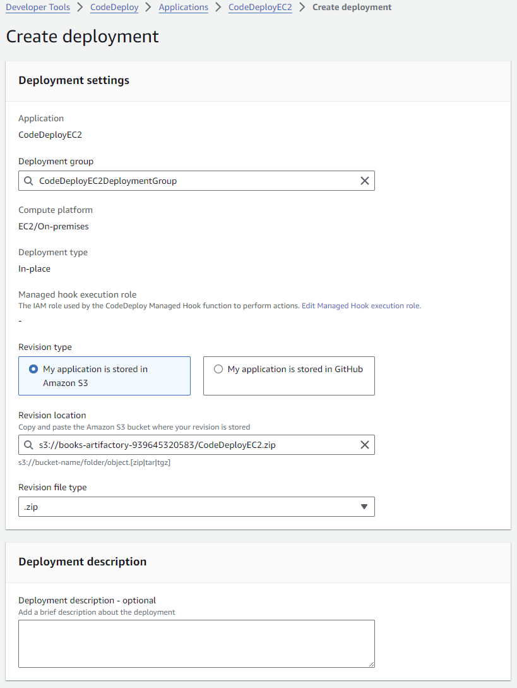

# 1. EC2 Instance

- Amazon Linux (Inferred)

# 2. EC2 Instance AWS IAM Role

- `AmazonEC2RoleforAWSCodeDeployLimited`
- `AmazonS3FullAccess`

# 3. CodeDeploy AWS IAM Role

- `AWSCodeDeployRole`

# 4. Install codedeploy agent on EC2

- https://docs.aws.amazon.com/codedeploy/latest/userguide/codedeploy-agent-operations-install-linux.html
- `wget https://aws-codedeploy-sa-east-1.s3.sa-east-1.amazonaws.com/latest/install`
- `sudo service codedeploy-agent status`

# 5. Install dotnet agent on EC2

- **Attention here because to this Linux Distribution, at the moment we only have .net 7.**
- https://learn.microsoft.com/en-us/dotnet/core/install/linux-centos

# 6. Dotnet project

1.  Publish project `dotnet publish -c Release -o ./app`
2.  Compact folder.
3.  Put .zip into Amazon S3 bucket.
4.  

# 7. CodeDeploy

1. 
2. 
3. 
4. 
